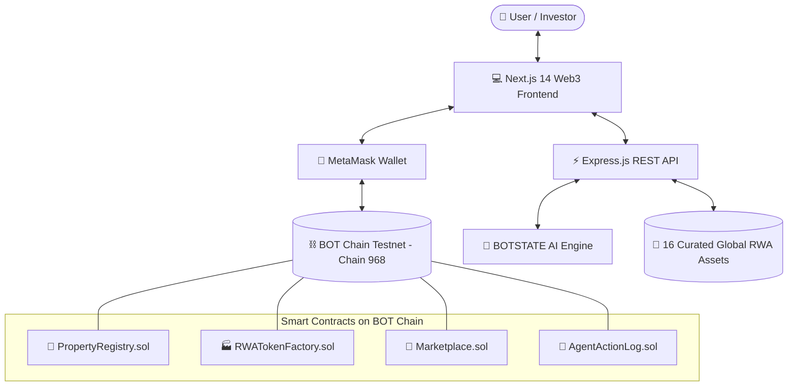

# 🏛️ BOTSTATE — AI-Powered Autonomous Real Estate Protocol

[-0A3D3D?style=for-the-badge&logo=blockchain.com)](https://scan.bohr.life)
[](https://soliditylang.org/)
[](https://nextjs.org/)
[](https://expressjs.com/)
[](https://botchain.ai)

> **Democratizing Global Real Estate Investment via Autonomous AI Agents and On-Chain Fractional Ownership on BOT Chain.**

---

## 🌟 Overview

**BOTSTATE** is a next-generation decentralized Real World Asset (RWA) protocol that combines **autonomous AI advisory agents** with **fractional tokenization on BOT Chain**. 

Investors worldwide can discover, analyze, and co-own prime tokenized commercial and residential properties across top global markets (Dubai, Tokyo, London, Singapore, Lisbon, Miami, Bali, Berlin) with fractional entry points as low as **0.05 tBOT**.

---

## 🚀 Key Features

- 🤖 **AIDID Verifiable AI Real Estate Advisor**: Autonomous on-chain AI agent with verifiable reputation that appraises properties, predicts rental yields, assesses macroeconomic risk, and logs every valuation on-chain.
- 🏢 **Fractional RWA Tokenization**: ERC-20 token factories deploying asset-backed smart contracts representing fractional property rights with automated quarterly dividend payouts.
- ⚡ **Direct On-Chain Settlement**: Non-custodial marketplace settled natively in `tBOT` on BOT Chain Testnet (Chain ID `968`).
- 📊 **Dynamic Portfolio Intelligence**: Real-time on-chain balance querying, asset tracking, and AI portfolio rebalancing suggestions.
- 🌍 **16 Curated Global Tier-1 Assets**: High-yield properties with real-world valuations, detailed risk matrices, and comparative market analysis.

---

## 🏗️ Architecture & Data Flow



---

## 📜 Deployed Smart Contracts (BOT Chain Testnet)

| Contract | Network | Explorer Link |
| :--- | :--- | :--- |
| **PropertyRegistry** | BOT Chain Testnet (968) | [View on scan.bohr.life](https://scan.bohr.life/address/0x6CeD8D6Bad8Dfd2e60BCEA116fE74548f959f1F2) |
| **RWATokenFactory** | BOT Chain Testnet (968) | [View on scan.bohr.life](https://scan.bohr.life/address/0x6CeD8D6Bad8Dfd2e60BCEA116fE74548f959f1F2) |
| **Marketplace** | BOT Chain Testnet (968) | [View on scan.bohr.life](https://scan.bohr.life/address/0x6CeD8D6Bad8Dfd2e60BCEA116fE74548f959f1F2) |
| **AgentActionLog** | BOT Chain Testnet (968) | [View on scan.bohr.life](https://scan.bohr.life/address/0x6CeD8D6Bad8Dfd2e60BCEA116fE74548f959f1F2) |

---

## ⚙️ Quickstart & Local Setup

### 1. Prerequisites
- Node.js >= 18
- MetaMask Extension

### 2. Installation
```bash
# Clone the repository
git clone https://github.com/Webghost01-NG/botstate.git
cd botstate

# Install backend dependencies
cd backend && npm install

# Install frontend dependencies
cd ../frontend && npm install

# Install smart contract dependencies
cd ../contracts && npm install
```

### 3. Run Backend API
```bash
cd backend
npm run dev
# Running on http://localhost:3001
```

### 4. Run Frontend Application
```bash
cd frontend
npm run dev
# Running on http://localhost:3000
```

### 5. Smart Contracts (Compile & Test)
```bash
cd contracts
npx hardhat compile
npx hardhat test
```

---

## 🌐 Network Settings for MetaMask

- **Network Name:** BOT Chain Testnet
- **RPC URL:** `https://rpc.bohr.life`
- **Chain ID:** `968` (`0x3C8`)
- **Currency Symbol:** `tBOT`
- **Block Explorer:** `https://scan.bohr.life`
- **Testnet Faucet:** [faucet.botchain.ai/basic](https://faucet.botchain.ai/basic)

---

## 🏆 Hackathon Track Alignment

- **AI-Native Layer 1 Integration**: Leverages BOT Chain's high-throughput EVM and native oracle standards.
- **AIDID Identity Standard**: Verifiable autonomous agent history, cryptographic action logging, and dynamic reputation scoring.
- **Real World Assets (RWA)**: Production-ready fractional ownership contracts with built-in dividend distribution logic.

---

## 📄 License
MIT License. Built for the BOT Chain Global Hackathon.
