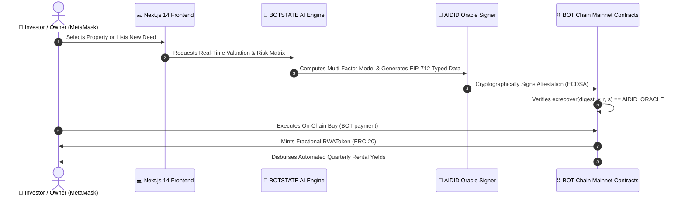

# 🏛️ BOTSTATE — AI-Powered Autonomous Real Estate Protocol

[-078984?style=for-the-badge&logo=blockchain.com)](https://scan.botchain.ai)
[](https://soliditylang.org/)
[](https://nextjs.org/)
[](https://eips.ethereum.org/EIPS/eip-712)
[](https://botchain.ai)

> **Fractional global real estate investment, appraised autonomously by verifiable on-chain AI agents on BOT Chain.**

---

## 🌟 Live Production Links

- 🌐 **Live Web Application:** [https://frontend-ecru-nu-85.vercel.app](https://frontend-ecru-nu-85.vercel.app)
- 🎮 **Guided Demo (Judge Simulator):** [https://frontend-ecru-nu-85.vercel.app/demo](https://frontend-ecru-nu-85.vercel.app/demo)
- ⛓️ **Mainnet Proof (Live On-Chain Receipts):** [https://frontend-ecru-nu-85.vercel.app/proof](https://frontend-ecru-nu-85.vercel.app/proof)
- 🏢 **Global Marketplace (16 Curated Assets):** [https://frontend-ecru-nu-85.vercel.app/properties](https://frontend-ecru-nu-85.vercel.app/properties)
- 🚀 **Tokenize Asset Launchpad:** [https://frontend-ecru-nu-85.vercel.app/properties/new](https://frontend-ecru-nu-85.vercel.app/properties/new)
- 🧠 **AI Investment Advisor (AIDID Engine):** [https://frontend-ecru-nu-85.vercel.app/chat](https://frontend-ecru-nu-85.vercel.app/chat)
- 💼 **On-Chain User Portfolio:** [https://frontend-ecru-nu-85.vercel.app/portfolio](https://frontend-ecru-nu-85.vercel.app/portfolio)
- 🤖 **Verifiable AIDID Agent Profile:** [https://frontend-ecru-nu-85.vercel.app/agent](https://frontend-ecru-nu-85.vercel.app/agent)

---

## 📜 Verified BOT Chain Mainnet Deployments (Chain ID: 677)

| Contract Name | Deployed Address | Block Number | Mainnet Explorer Link |
| :--- | :--- | :--- | :--- |
| **PropertyRegistry** | `0x8cd2DA9E45D18c47A803f065a3625AE68bF37B17` | `20198070` | [View on BOTScan](https://scan.botchain.ai/address/0x8cd2DA9E45D18c47A803f065a3625AE68bF37B17) |
| **RWATokenFactory** | `0x0908E0409d593409D251306302FDca0C45198B9C` | `20198081` | [View on BOTScan](https://scan.botchain.ai/address/0x0908E0409d593409D251306302FDca0C45198B9C) |
| **Marketplace** | `0x08D1B8fD3b831e79f000fFA3B1B0F69064080f24` | `20198086` | [View on BOTScan](https://scan.botchain.ai/address/0x08D1B8fD3b831e79f000fFA3B1B0F69064080f24) |
| **AgentActionLog** | `0xbb42F96B7Dd1FC127f7A9729C178EFE15ADa8F0a` | `20198091` | [View on BOTScan](https://scan.botchain.ai/address/0xbb42F96B7Dd1FC127f7A9729C178EFE15ADa8F0a) |

---

## 🎯 The Core Problem & The BOTSTATE Solution

### The Problem ($330T Real Estate Market Bottlenecks)
1. **$100k+ Capital Barrier & Extreme Illiquidity**: 99% of global retail investors are excluded from prime international real estate.
2. **Subjective & Biased Valuations**: Traditional appraisals rely on slow, manual paper assessments with zero cryptographic auditability.
3. **Opaque Settlement & High Intermediary Fees**: Buying property takes weeks of legal bureaucracy with 5-10% broker fees.

### The BOTSTATE Solution
1. **Fractional RWA Tokenization**: Democratizes property co-ownership starting from **0.05 BOT**.
2. **Autonomous AIDID AI Appraiser**: Continually calculates multi-factor fair-market valuations and signs them with **EIP-712 cryptographic attestations**.
3. **Asset Tokenization Launchpad (`/properties/new`)**: Enables any verified property owner to tokenize their deed and sell fractional shares on-chain in 30 seconds.
4. **Automated On-Chain Yields**: Rental revenue is automatically disbursed directly to token holders' wallets on BOT Chain.

---

## 🏗️ Technical Architecture & Cryptographic Flow



---

## 🔑 Mainnet Network & Oracle Configuration

- **Network Name:** BOT Chain Mainnet
- **Chain ID:** `677` (`0x2A5`)
- **RPC Endpoint:** `https://rpc.botchain.ai`
- **Block Explorer:** `https://scan.botchain.ai`
- **Oracle DID / Deployer:** [`0x6CeD8D6Bad8Dfd2e60BCEA116fE74548f959f1F2`](https://scan.botchain.ai/address/0x6CeD8D6Bad8Dfd2e60BCEA116fE74548f959f1F2)

---

## ⚙️ Quickstart & Local Setup

```bash
# Clone repository
git clone https://github.com/Webghost01-NG/botstate.git
cd botstate

# Start Frontend & API (Port 3000)
cd frontend && npm install && npm run dev
```

---

## 📄 License
MIT License. Built for the BOT Chain Global Hackathon.
